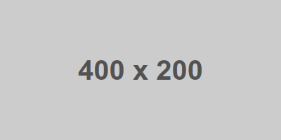

# Placeholder

Custom placeholders in web components. Can be used with popular JavaScript frameworks or HTML tags.

## Usage

Insert the following script tag to your page:

``` html
<script type="module" src="https://unpkg.com/@placeholders/core@0.0.3/dist/esm/placeholders.js"></script>
```

Then you can use `<placeholder-xxx>` tags. For example:

| Tag                                                                   | Output                                                |
|-----------------------------------------------------------------------|-------------------------------------------------------|
| `<placeholder-image width="400" height="200">`                        |     |
| `<placeholder-lines size="10">`                                       |     |
| `<placeholder-text>Lorem ipsum dolor sit amet ...</placeholder-text>` |       |

## Local development

* Install the dependencies

``` console
$ npm install
```

* Build for production

``` console
$ npm run build
```

* Run locally

``` console
$ npm run dev
```

Open http://localhost:3333 in your browser to see it in action.

## Contributing

PRs, suggestions are welcome!

## About

This project is developed by _Nguyen Huu Phuoc_. I love building products and sharing knowledge.

Be my friend on
* [Twitter](https://twitter.com/nghuuphuoc)
* [dev.to](https://dev.to/phuocng)
* [Github](https://github.com/phuoc-ng)
